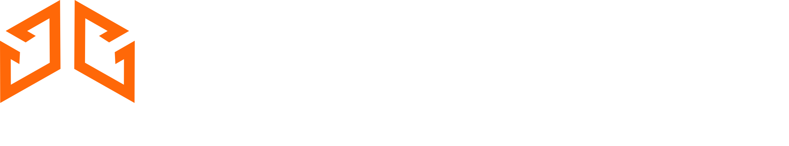

<picture height="20">
  <source media="(prefers-color-scheme: dark)" width="498.69" height="93" srcset="./OpenForte_Dark.webp">
  <source media="(prefers-color-scheme: light)" width="498.69" height="93" srcset="./OpenForte_Light.webp">
  
</picture>

## We Build Software for Experts

OpenForte is a passionate team of technical specialists building innovative software for experts. We use best practices and optimize technology to improve how technical work is done, turning ambitious ideas into market-leading products.

## 🚀 What We Do

We specialize in creating sophisticated software solutions that empower technical professionals to work more efficiently. Our focus is on:

- **Systems Engineering** - Building tools that help engineers design and analyze complex systems
- **AI Integration** - Implementing artificial intelligence directly into professional workflows
- **Reliability & Safety** - Creating solutions for reliability engineering and safety analysis
- **Technical Innovation** - Transforming how technical work is performed through cutting-edge technology

## 💡 Our Flagship Product

### WeaveOS
*AI-native engineering platform for reliability, safety, and systems engineering*

WeaveOS revolutionizes engineering workflows by integrating AI through Model Context Protocol (MCP). Engineers can:
- Create reliability block diagrams using natural language
- Perform complex calculations and analysis in minutes instead of hours
- Receive AI-powered design improvement suggestions
- Generate comprehensive documentation automatically
- Scale from individual use to enterprise deployment

## 🛠️ How We Build

Our development philosophy combines:
- **Deep Problem Understanding** - We start by thoroughly understanding the challenges our users face
- **Technical Excellence** - Every product receives the technical rigor and craftsmanship needed to succeed
- **Rapid Experimentation** - We iterate quickly while maintaining long-term vision
- **Best Practices** - We maximize technology potential through industry-leading practices
- **User Focus** - We build for experts, by experts

## 🌐 Connect With Us

- **Website**: [openforte.com.au](https://openforte.com.ai)
- **Products**: Explore our portfolio of innovative software solutions

## 🤝 Working With OpenForte

We're technical specialists who roll up our sleeves and build. Whether you're looking to:
- Transform technical workflows in your organization
- Build custom solutions for complex engineering challenges
- Integrate AI into professional tools
- Scale from proof-of-concept to enterprise deployment

We bring the expertise and dedication needed to turn ambitious technical ideas into market-leading products.

---

*OpenForte™ - Empowering experts through innovative software*